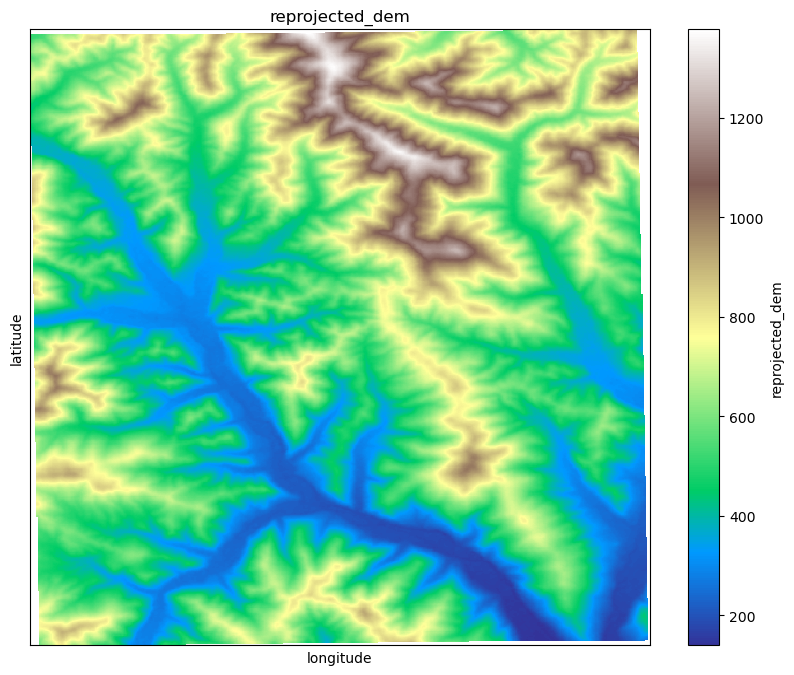
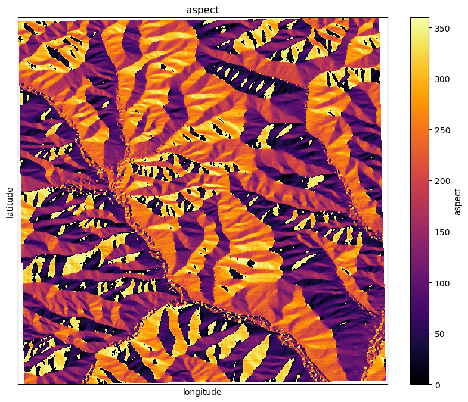

## Описание
Библиотека для рассчета различных показателей, характеризующих рельеф. 

Данные о высоте (DEM) загружаются из GEE (по API) и сохраняются локально для заданной области. Показатели рельефа рассчитываются с помощью xdem.

Данные хранятся в float16.

Пространственное разрешение = 30 метров

Данные о высоте собраны в феврале 2000 года. Временного измерения у данных нет.

Список показателей, которые можно рассчитать с помощью данной библиотеки:

- DEM (ЦМР, высота над уровнем моря)
- slope (Уклон)
- hillshade (Теневой рельеф)
- aspect (Азимут, направление склона)
- curvature (Кривизна)
- planform_curvature (Плановая кривизна)
- profile_curvature (Профильная кривизна)
- maximum_curvature (Максимальная кривизна)
- topographic_position_index (Индекс топографической позиции)
- terrain_ruggedness_index (Индекс шероховатости рельефа)
- roughness (Шероховатость рельефа)
- rugosity (Ругозность)

## Структура репозитория 

```
dem_analysis_api/
├── README.md
├── requirements.txt
├── setup.py
├── src/
│   ├── __init__.py
│   ├── data_download.py
│   ├── calculations.py
│   ├── utils.py
|   ├── plotting.py
└── examples/
    ├── example_usage.ipynb
    ├── generate_plots.ipynb
```
## Использование

**Установка**
1. Клонируйте репозиторий
```bash
git clone https://github.com/kostkornilov/dem_api
cd dem_api
```
2. Установите зависимости
```bash
pip install -e .
```

**Авторизация в Google Earth Engine** 
Перед использованием необходимо авторизоваться в Google Earth Engine:

Выполните команду:
```bash
earthengine authenticate
```
Войдите в свой Google-аккаунт и скопируйте предоставленный токен.

Вставьте токен в терминал.

## Пример использования

Пример использования представлен в файле ```example_usage.ipynb```

## Рассчитываемые показатели
### Пример:
- Область с координатами центра lat, lon = 45, 136 и буфером в 0.1 градус
- Высота:
  


- Уклон:


- Экспозиция:


